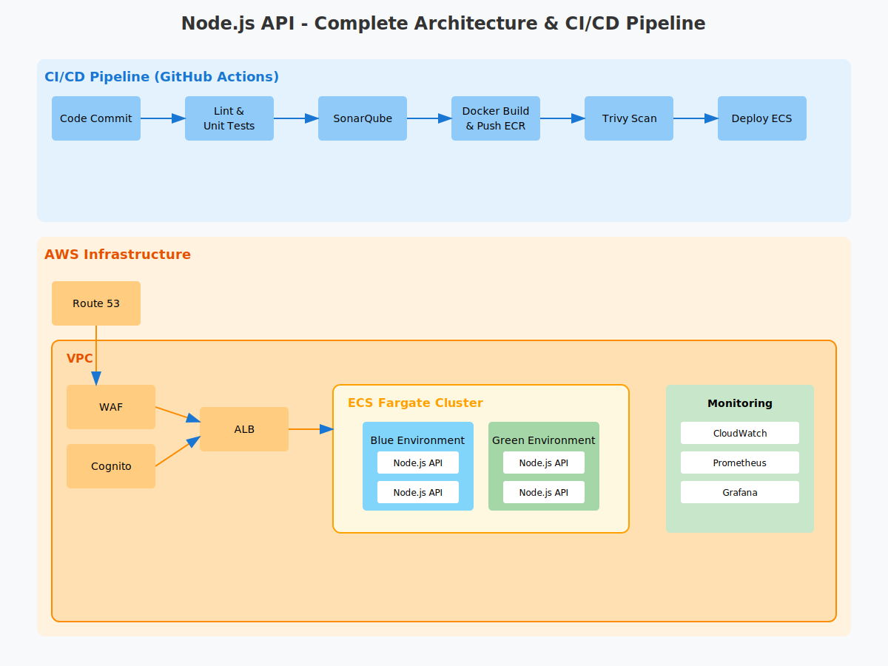

# Node.js API - Infrastructure and CI/CD Setup

## Overview

This repository contains the infrastructure and CI/CD pipeline setup for a **Node.js API** that generates dummy data. The API allows users to specify the fields (first name, last name, email, phone number, etc.) and the number of records required. The system is designed with **high availability, security, and automated deployments**.

---


# Diagram



## **Architecture**

### **Key Components**

1. **AWS ECS (Fargate)** - Deploys and manages the containerized Node.js API.
2. **AWS ALB (Application Load Balancer)** - Handles routing and load balancing.
3. **AWS WAF (Web Application Firewall)** - Implements rate limiting and security rules.
4. **AWS Cognito** - Provides user authentication at the infrastructure level.
5. **AWS Route 53** - Manages domain names and DNS resolution.
6. **AWS CloudWatch** - Monitors API logs and performance.
7. **Prometheus & Grafana** - Collects and visualizes API metrics.
8. **Terraform** - Manages infrastructure as code (IaC).
9. **GitHub Actions** - Implements CI/CD pipeline automation.
10. **SonarQube & Trivy** - Ensures code quality and security.

---

## **Repository Structure**

```plaintext
├── .github/workflows/       # CI/CD Pipelines
│   ├── ci.yml              # Main CI pipeline
│   ├── cd-staging.yml      # Staging deployment
│   ├── cd-production.yml   # Production deployment
├── infrastructure/         # Terraform Infrastructure Setup
│   ├── modules/           
│   │   ├── ecs/           
│   │   │   ├── main.tf    # ECS Cluster & Task Definitions
│   │   │   ├── variables.tf
│   │   │   ├── outputs.tf 
│   │   ├── networking/    
│   │   │   ├── main.tf    # Networking setup
│   │   │   ├── variables.tf
│   │   │   ├── outputs.tf 
│   │   ├── security/      
│   │   ├── monitoring/    
│   ├── environments/      
│   │   ├── staging/       
│   │   │   ├── main.tf    # Staging environment setup
│   │   │   ├── variables.tf
│   │   │   ├── terraform.tfvars 
│   │   ├── production/    
│   ├── backend.tf         
│   ├── provider.tf        # Terraform Provider Configuration
│   ├── variables.tf       # Global Terraform Variables
├── Dockerfile             
├── docker-compose.yml     
├── README.md              
└── sonar-project.properties 
```

---

## **Workflow Diagram**

```plaintext
[ Developer ] --> [ GitHub Repo ] --> [ GitHub Actions ] --> [ AWS ECS ]
                                         |        |
                                         |        --> [ AWS ECR ]
                                         --> [ SonarQube & Trivy ]
```

---

## **CI/CD Pipeline Diagram**

```plaintext
[ Code Commit ] --> [ GitHub Actions ] --> [ Lint & Test ] --> [ Build Docker Image ] --> [ Security Scan ] --> [ Deploy to ECS ]
```

---

## **Setup & Deployment**

1. **Clone the Repository:**
   ```sh
   git clone https://github.com/your-username/nodejs-api-architecture.git
   cd nodejs-api-architecture
   ```
2. **Initialize Terraform:**
   ```sh
   terraform init
   ```
3. **Apply Terraform Configuration:**
   ```sh
   terraform apply -auto-approve
   ```
4. **Push Code & Trigger CI/CD Pipeline:**
   - Commit & push your code.
   - GitHub Actions will build, test, scan, and deploy automatically.

---

## **Next Steps**

- Implement the architecture in AWS.
- Test API endpoints and security configurations.
- Optimize infrastructure costs and performance.

*Thank You !* 

